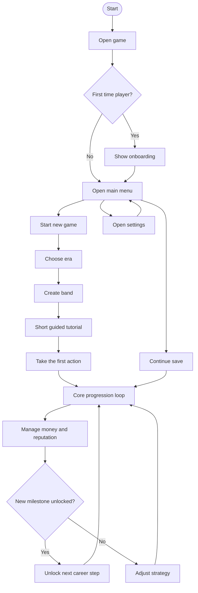

# Player Journey Diagram

This is the feature-owned source of truth for the player journey flowchart.

## Notes

- The first player choice is era selection.
- The journey should remain short on first launch.
- This diagram is referenced by [docs/journeys/player-journey.md](../../../journeys/player-journey.md).