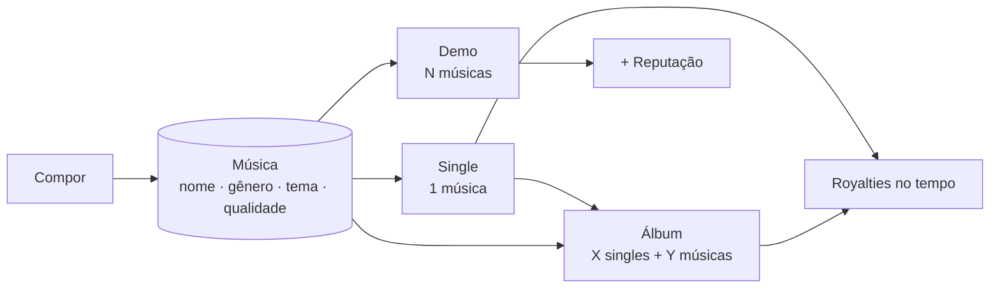

# Feature 0015 - Diagrams

Diagramas-fonte (Mermaid) da cadeia de songwriting e lançamentos.

## Cadeia composição → lançamento (rascunho — confirmar na Q3)

*(Estrutura sujeita às decisões de Q3/Q4. Atualizar quando aprovadas.)*
