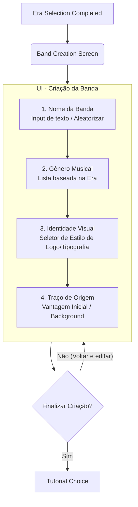

# Band Creation Flow

```mermaid
flowchart TD
    A[Era Selection Completed] --> B(Band Creation Screen)

    subgraph Interface [UI - Criação da Banda]
        direction TB
        Input[1. Nome da Banda\nInput de texto / Aleatorizar]
        Genre[2. Gênero Musical\nLista baseada na Era]
        Logo[3. Identidade Visual\nSeletor de Estilo de Logo/Tipografia]
        Perk[4. Traço de Origem\nVantagem Inicial / Background]
        
        Input --> Genre
        Genre --> Logo
        Logo --> Perk
    end
    
    B --> Interface
    Interface --> Confirm{Finalizar Criação?}
    Confirm -- Não (Voltar e editar) --> Interface
    Confirm -- Sim --> T[Tutorial Choice]
```
