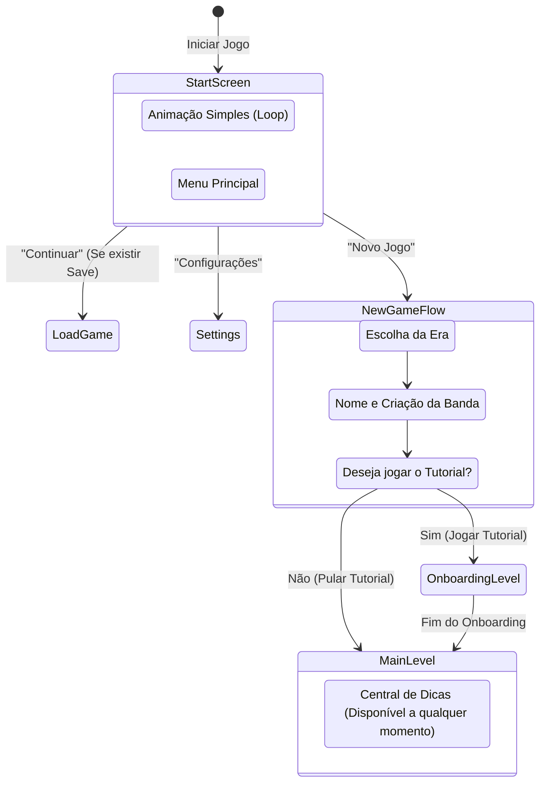

# Start Screen and Onboarding Flow

```mermaid
stateDiagram-v2
    [*] --> StartScreen : Iniciar Jogo

    state StartScreen {
        direction LR
        BannerAnimação : Animação Simples (Loop)
        Menu : Menu Principal
    }

    StartScreen --> LoadGame : "Continuar" (Se existir Save)
    StartScreen --> Settings : "Configurações"
    StartScreen --> NewGameFlow : "Novo Jogo"

    state NewGameFlow {
        EraSelection : Escolha da Era
        BandCreation : Nome e Criação da Banda
        TutorialChoice : Deseja jogar o Tutorial?
        
        EraSelection --> BandCreation
        BandCreation --> TutorialChoice
    }

    TutorialChoice --> OnboardingLevel : Sim (Jogar Tutorial)
    TutorialChoice --> MainLevel : Não (Pular Tutorial)

    OnboardingLevel --> MainLevel : Fim do Onboarding
    
    state MainLevel {
        HelpSystem : Central de Dicas (Disponível a qualquer momento)
    }
```
