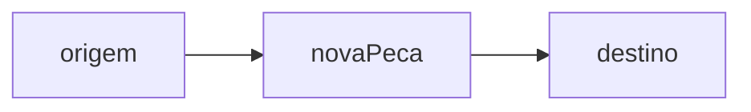

# Feature Template

Use this file as the starting point for every new feature.

## Folder layout

```
docs/features/feature-slug/
  README.md
  diagrams/
    README.md
  planning/
    overview.md
    design.md        <- opcional, ver "Design template"
    plan-NN.md       <- gate G1.5, um por slice; ver "Plan template"
  refinement/
    decomposition.md
    checklist.md
    questions.md
    iteration-01.md
    log.md
```

## Planning template

```
# Feature 000X - Feature Name (Planning)

## Problem
Describe the problem the feature solves.

## Goals
- Goal one.
- Goal two.

## Initial scope
- Slice one.
- Slice two.

## Non-goals (nesta fase)
- O que explicitamente não está incluso ainda.

## Acceptance criteria
- The feature is described clearly enough for refinement.
- The scope is small enough for incremental implementation.
```

## Decomposition template

```
# Feature 000X - Feature Name (Decomposition)

## Epic breakdown
- Smaller feature one.
- Smaller feature two.
- Smaller feature three.

## Why split
- Reduce cognitive load.
- Create implementation-sized slices.
- Allow independent validation and handoff.

## Recommended order
1. First smaller feature.
2. Second smaller feature.
3. Third smaller feature.
```

## Design template (opcional)

Use apenas quando a feature tiver decisões de arquitetura relevantes, ou for
grande o suficiente para precisar de um design técnico separado da spec
funcional. Features pequenas podem ir direto de `planning/overview.md` para
`refinement/iteration-01.md` sem este arquivo.

```
# Feature 000X - Feature Name (Design)

## Componentes afetados
- Componente um.
- Componente dois.

## Modelo de dados (se houver)
- Entidade um: campos relevantes.

## Decisões técnicas
- Decisão e justificativa.

## Riscos e trade-offs
- Risco um e como será mitigado.
```

## Plan template (gate G1.5 — Plano de slice)

Um arquivo curto por slice/bolt, em `planning/plan-NN.md` (`NN` = o slice). É o
blueprint **prático, virado ao desenvolvedor** que traduz a iteração aprovada para
o "como", e que o humano valida **antes** de qualquer código. Só exigido para
mecânica/economia/progressão/UI estrutural — mudança pequena faz fast-track e pula.
**Snippets, não código:** só assinaturas e o ponto de encaixe, nunca o corpo das
funções.

````
# Feature 000X - Feature Name — Plano slice NN (G1.5)

## Objetivo prático
- 1–2 linhas: o que o dev constrói neste slice.

## Arquivos tocados
- `caminho/arquivo.ts` — novo | alterado: o que muda.

## Snippets-chave (assinaturas + ponto de encaixe, sem corpo)
```ts
funcaoNova(args): Retorno
TipoExistente += { campoNovo }
// onde pluga: store.advanceDays -> chama X antes de Y
```

## Rastreabilidade (Decisão -> mudança -> teste)
| Dx | Mudança no código | Teste planejado |
|----|-------------------|-----------------|
| D1 | ...               | ... (×N)        |

## Bordas e não-escopo
- Caso de borda tratado.
- O que NÃO entra neste slice.

## Diagrama de encaixe (Mermaid)

````

## Checklist template

```
# Feature 000X - Feature Name (Checklist)

## Planning
- [ ] Problem is clearly stated.
- [ ] Goals are measurable or at least falsifiable.
- [ ] Non-goals are explicit.

## Refinement
- [ ] All blocking questions in `questions.md` are answered.
- [ ] Latest iteration reflects the current decision, not a stale one.

## Handoff readiness
- [ ] Scope can be split into small, testable implementation steps.
- [ ] `band-quest-game` team/agent has enough context without re-reading the whole history.

## Plan readiness (gate G1.5 — só mecânica/economia/progressão/UI)
- [ ] `planning/plan-NN.md` existe para o slice.
- [ ] Cada decisão (Dx) mapeia para mudança + teste planejado.
- [ ] Snippets cobrem assinaturas e ponto de encaixe (sem corpo de função).
- [ ] Plano aprovado pelo humano antes de codar.
```

## Questions template

```
# Feature 000X - Feature Name (Questions)

## Open Questions

### [Q1] Question short title?
**Context:** Why is this a blocking issue or important to define now?
**Status:** 🔴 Blocking / 🟡 Needs Discussion / 🟢 Minor
**Options:**
- [A] Option A: ...
- [B] Option B: ...
- [C] Option C: ...
- [D] Option D: ...
- [X] Open option: (Let user define another solution)

**Answer:** [User, please type your answer here (e.g., A, B, or your custom text)]

## Resolved Questions

### [Q0] Example of a resolved question?
**Decision:** We chose X because of Y.
**References:** Solved in `iteration-XX.md`.
```

## Iteration template

```
# Feature 000X - Feature Name (Refinement 01)

## Decisions
- Decision one.
- Decision two.

## Questions
- Question one.
- Question two.

## Checklist result
- [ ] Scope reviewed.
- [ ] Questions updated.
- [ ] Handoff reviewed.
```

## Log template

Use exactly this format — it is the only valid log format in this repository.

```
# Feature 000X - Feature Name (Log)

## [0.1.0] - YYYY-MM-DDTHH:MM:SSZ

### Input
- Original user request or change request.

### Summary
- What the agent did in this iteration.

### Open questions
- Anything still unresolved.

### Next step
- The next decision or action.
```

## Local README template

```
# Feature 000X - Feature Name

**Status:** Planning / In Refinement / Ready for Implementation

## Navigation
- [Diagrams](diagrams/README.md)
- [Planning overview](planning/overview.md)
- [Decomposition](refinement/decomposition.md)
- [Checklist](refinement/checklist.md)
- [Open questions](refinement/questions.md)
- [Latest iteration](refinement/iteration-01.md)
- [Action log](refinement/log.md)
```
